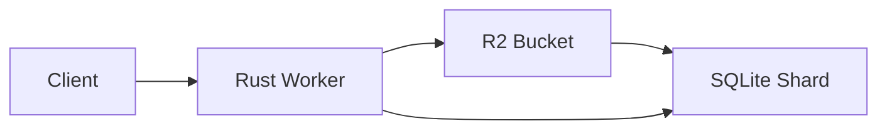

# Overture Geocoder

A high-performance forward and reverse geocoder built on [Overture Maps](https://overturemaps.org/) data, powered by **Rust**, **Cloudflare Workers**, and **R2**.

## Features

- **Global Coverage**: 450K+ cities, neighborhoods, and administrative areas worldwide.
- **Serverless Architecture**: Runs entirely on Cloudflare Workers with zero persistent server management.
- **Cost-Effective**: Uses SQLite shards stored in R2 to bypass database storage limits and minimize costs.
- **Fast Search**: Full-Text Search (FTS5) with prefix matching for autocomplete.
- **Reverse Geocoding**: Efficient point-in-polygon checks using bounding box indexes and hierarchical resolution.
- **Zero Egress**: Client-side libraries can fetch full geometry directly from Overture's S3 buckets.

## API

Base URL: `https://geocoder.bradr.dev`

### Forward Geocoding (Search)

**Endpoint:** `GET /search`

| Parameter | Type | Default | Description |
|-----------|------|---------|-------------|
| `q` | string | required | Search query (e.g., "Boston", "New York") |
| `limit` | int | 10 | Max results to return (1-40) |
| `autocomplete` | bool | true | Enable prefix matching for the last token |
| `format` | string | json | Response format: `json` or `geojson` |

**Example:**
```bash
curl "https://geocoder.bradr.dev/search?q=boston&limit=1"
```

**Response:**
```json
{
  "results": [
    {
      "gers_id": "...",
      "name": "Boston",
      "type": "locality",
      "lat": 42.3601,
      "lon": -71.0589,
      "bbox": [ ... ],
      "importance": 0.85,
      "country": "US",
      "region": "US-MA"
    }
  ]
}
```

### Reverse Geocoding

**Endpoint:** `GET /reverse`

| Parameter | Type | Default | Description |
|-----------|------|---------|-------------|
| `lat` | float | required | Latitude (-90 to 90) |
| `lon` | float | required | Longitude (-180 to 180) |
| `format` | string | json | Response format: `json` or `geojson` |

**Example:**
```bash
curl "https://geocoder.bradr.dev/reverse?lat=42.3601&lon=-71.0589"
```

## Architecture

This project uses a **sharded architecture** to handle global datasets within the constraints of serverless edge computing.

1.  **Data Ingestion**:
    *   `scripts/download_divisions.sh` uses **DuckDB** to extract division data from Overture Maps' S3 buckets (Parquet format).
2.  **Shard Generation**:
    *   `scripts/build_shards.py` partitions the data (e.g., by country or region) into optimized **SQLite databases**.
    *   Each shard contains an FTS5 index for search and spatial indexes for reverse geocoding.
3.  **Storage**:
    *   Shards are uploaded to **Cloudflare R2** (`geocoder-shards` bucket).
4.  **Runtime**:
    *   The **Rust Worker** (`crates/geocoder-worker`) handles requests.
    *   It dynamically fetches the required SQLite shard from R2, caches it, and queries it using the native SQLite API in Cloudflare Workers.



## Development

### Prerequisites

*   Rust (latest stable)
*   Node.js & npm
*   Cloudflare Wrangler (`npm install -g wrangler`)
*   DuckDB (for data scripts)

### Setup

1.  **Install Dependencies:**
    ```bash
    cargo install worker-build
    pip install duckdb
    ```

2.  **Build & Run Worker:**
    ```bash
    cd crates/geocoder-worker
    wrangler dev
    ```

3.  **Generate Local Test Data:**
    ```bash
    # Downloads MA data and builds a local shard for testing
    ./scripts/setup-local-db.sh
    ```

### Deployment

Deploy the worker to Cloudflare:

```bash
cd crates/geocoder-worker
wrangler deploy
```

## GitHub Actions

### `Deploy Rust Worker`
Automatically deploys the worker to Cloudflare on pushes to `main` affecting `crates/`.

### `Rebuild R2 Shards`
A scheduled workflow (monthly) that updates the data from the latest Overture release.
*   **Manual Trigger**: You can manually run this workflow to rebuild specific shards.
*   **Inputs**:
    *   `countries`: Comma-separated list (e.g., `US,CA`) to limit the build.
    *   `build_type`: `forward`, `reverse`, or `both`.
    *   `confirm`: Type `REBUILD` to confirm destructive updates (not required for scheduled runs).

## License

MIT